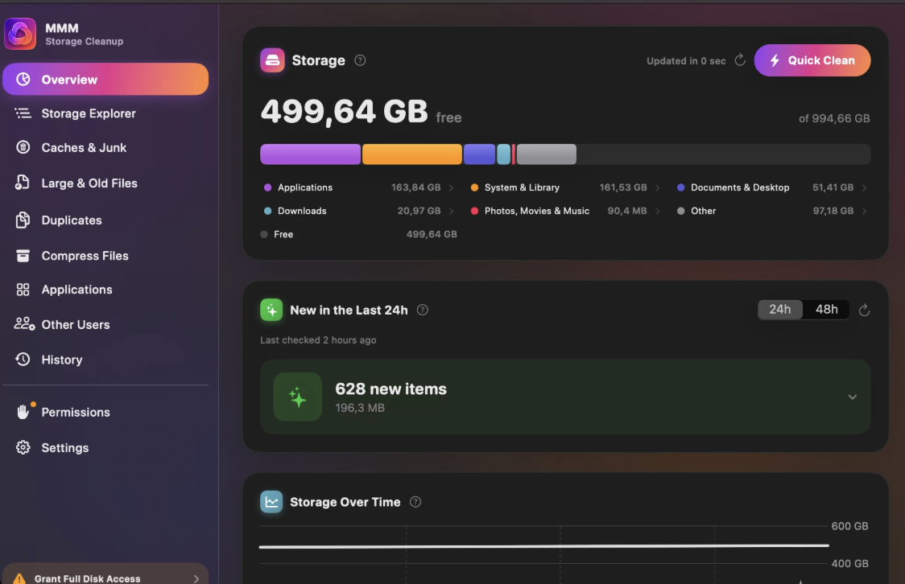

# MacMemMan

A native macOS storage-cleanup app, built because the usual options are either a paid black box
(CleanMyMac-style tools that delete first and explain never) or a manual slog through Finder with
`du` in a terminal tab. MacMemMan sits in between: it finds caches, logs, developer junk,
large/old files, duplicates, compressible files, apps with leftovers, and even space tied up in
*other* user accounts on the same Mac — but it never deletes anything you haven't personally seen,
itemized, and confirmed first.



## Get MacMemMan

**Download** — grab the latest `MacMemMan.dmg` from this repository's
[Releases](../../releases) page, open it, and drag `MacMemMan.app` into `Applications`. The
build isn't notarized (see [Distribution](#distribution-building-a-dmg) below), so the first
launch needs one extra step: right-click the app in `Applications` → **Open** → confirm in the
dialog (only needed once), or **System Settings → Privacy & Security → Open Anyway** if macOS
already blocked it.

**Build from source** — see [Build & run](#build--run) below. Useful if you want to audit the
code before running it (it's not sandboxed — see [Why not sandboxed?](#why-not-sandboxed)) or if
no release has been published yet.

## Features

- **Overview dashboard** — a segmented capacity bar (à la "About This Mac → Storage") that's
  tappable per segment for a one-level drill-down, including an itemized breakdown of the "Other"
  segment (hidden home-folder dotfiles/dev-tool caches, plus an honest system-wide remainder) so
  it's never just an unexplained leftover chunk. Also: a file-type breakdown (photos/video/audio/
  docs, wherever they're hiding on disk), a storage-over-time trend chart (total usage plus a line
  per tracked category, snapshotted at most once an hour), and a one-click **Quick Clean** that
  scans and lands you straight in the Review screen.
- **Storage Explorer** — a drill-down folder tree, sized on demand as you expand each folder, so
  opening it never has to walk the whole disk up front.
- **Caches & Junk** — known-safe cache, log, browser-cache, developer-tool, and Trash locations.
- **Large & Old Files** — configurable size/age thresholds in any folder, with filters to narrow
  results by safety rating (Safe/Caution/Personal) or by file type (images, video, documents,
  code, archives, ...).
- **Duplicates** — hash-based, keeps the oldest copy selected by default (never a personal photo/
  video/document, even if it's technically a duplicate). Two ways to review a result set: by
  duplicate set (the classic grouped list, with a location chip per copy) or **by folder** — a
  real navigable tree so you can see where copies actually live before deciding what to remove.
- **Compress Files** — transparent, lossless APFS compression (via `ditto --hfsCompression`, the
  same mechanism macOS uses for its own system files) for compressible file types. Files stay
  byte-identical when opened — verified with `cmp` before ever touching the original — they just
  use less space on disk.
- **Applications** — uninstaller that finds an app's leftover Application Support/Caches/
  Preferences/Saved State/Container files elsewhere on disk, grouped by kind, with "last used"
  dates (via Spotlight metadata) and a "clean leftovers only, keep the app" option.
- **Other Users** — for an admin account: see how much space other local accounts on the same Mac
  are using, and clean up their Caches/Logs/Trash (never Documents, Photos, or anything else that
  might hold someone else's irreplaceable files). Every scan and every cleanup costs a real macOS
  admin-password prompt — nothing here ever runs silently, and nothing is ever pre-selected.
- **History** — a permanent log of everything actually deleted (and anything that failed, with
  why), independent of any single scan's on-screen results.
- **Automatic Cleanup** — an optional background check (configurable frequency and
  aggressiveness) that proposes a cleanup via an approval banner + system notification — it only
  ever *finds* things, exactly like a manual scan; nothing is deleted without you confirming in
  the Review screen.
- **Menu bar** — MacMemMan lives in the menu bar so the background check keeps running with the
  window closed; the dropdown shows a live capacity bar plus quick actions. The sidebar itself
  shows a live spinner next to any section with a scan or cleanup still running in the
  background, even after you've navigated away from it.
- **Results survive quitting the app** — every section's last scan is cached to disk, so
  relaunching MacMemMan shows real results immediately instead of a blank "tap Scan" screen; a
  fresh scan then quietly runs in the background and updates the list in place.

## AI Assist (optional)

Every scan result, and every AI action, is available whether or not you've set up AI — the
sparkle button is always visible; tapping it without a saved key opens a short setup sheet
(what it does, a link to get a key, and a field to paste one) right where you tapped, instead of
sending you off to hunt for Settings.

With a key saved (Settings, or that setup sheet), Claude can:

- **Explain any item** — a sparkle button on every scan result (Junk, Large & Old, Duplicates,
  Uninstaller leftovers, and the Review screen) asks what an unfamiliar file/folder most likely is
  and whether it looks safe to remove.
- **Summarize a scan** — one click after any scan turns the raw list into a couple of plain-
  language sentences: what's actually using the space, what's probably fine to remove.
- **Suggest a selection** — asks which non-personal items are worth removing and pre-checks them
  with a one-line reason each; anything rated "Personal" is filtered out before the request is
  even sent, so a suggestion can never touch something irreplaceable.
- **Duplicate-specific**: "Which copy should I keep?" — given a set of identical files and where/
  when each one was last touched, a plain-language read on which looks like the original.
- **Uninstaller-specific**: "What is this app?" — a read on an unfamiliar app before you decide to
  remove it, based only on its name and bundle identifier.

Only metadata is ever sent (name, path, size, dates, extension) — **never file contents**. The API
key lives in the macOS Keychain only.

## Safety model

Every scanner only ever *finds* things — `[ScanItem]` results, never a deletion. Selections flow
into a `ReviewManifest`, and the Review Sheet is the single mandatory gate before anything is
removed: itemized list grouped by category, full paths, a per-item safety rating (Safe / Caution /
Personal — review), and a running "you'll free up X" total. Deletion defaults to moving items to
the Trash (recoverable); permanent deletion is an explicit, separate choice.

Every item gets an automatic safety rating (`SafetyAssessor`) from its category *and* its content —
a cache folder is `Safe`; a `.heic` in Downloads or a `.docx` in Documents is `Personal`,
regardless of size or age. Only `Safe` items are ever pre-selected after a scan; personal/caution
items are always visible but require you to check them by hand. Flows that hand over raw,
unfiltered results (Quick Clean, the background auto-cleanup) apply the same rule via
`ReviewManifest.preExcludedIDs` — caution/personal items start unchecked there too, exactly like a
manually curated selection would.

Cleaning up another user account's files (**Other Users**) is a stricter case still: those items
can never be rated `Safe` no matter how disposable the location normally is, are never
pre-selected, and both scanning and deleting are restricted to a fixed, known-junk catalog
(Caches/Logs/Trash) with a second independent path check immediately before deletion — never a
bare account home, never anything else.

## Requirements

- macOS 13 Ventura or later, Xcode 14+ (Swift 5.7+)
- [XcodeGen](https://github.com/yonaskolb/XcodeGen) (`brew install xcodegen`) — generates the
  `.xcodeproj` from `project.yml`. The `.xcodeproj` itself isn't committed (see `.gitignore`);
  regenerate it any time with `xcodegen generate`.

## Build & run

```sh
xcodegen generate
open MacMemMan.xcodeproj   # then Cmd+R in Xcode
```

or from the command line:

```sh
xcodegen generate
xcodebuild -scheme MacMemMan -configuration Debug build
open ~/Library/Developer/Xcode/DerivedData/MacMemMan-*/Build/Products/Debug/MacMemMan.app
```

## Full Disk Access

MacMemMan is **not sandboxed** (distributed outside the App Store on purpose — see "Why not
sandboxed?" below), so it can reach system-wide caches, logs, and other apps' leftover files. To
scan those locations, grant it Full Disk Access:

**System Settings → Privacy & Security → Full Disk Access → enable MacMemMan**

The in-app **Permissions** screen shows current status and links straight there — it's also where
you'd come back to grant this later if you skipped it initially. Without it, the app still works
fully for your own files (Downloads, Documents, per-app caches in `~/Library`) — system-wide
locations are just skipped with a note instead of erroring, and reads that would otherwise hang on
a blocked permission prompt are hard-capped with a timeout so nothing in the app can freeze.

### Why not sandboxed?

A Mac App Store build must run inside Apple's sandbox, which would only let it touch its own
container and files the user explicitly picks one at a time — it couldn't see `~/Library/Caches`,
system logs, or other apps' support files, which is most of what a cleaner app needs to find.
Distributing outside the App Store (direct download, notarized for a real release) trades App
Store convenience for that capability, same as DaisyDisk/CleanMyMac.

## Distribution (building a DMG)

```sh
./scripts/build-dmg.sh
```

This builds a Release configuration and packages it into `dist/MacMemMan.dmg` (the app plus an
`Applications` shortcut, the standard drag-to-install layout). See the comment block at the top of
the script for the full explanation, but the short version:

**This repo has no Apple Developer Team configured**, so the build is only ad-hoc signed, not
signed with a real Developer ID and not notarized. Anyone you hand the DMG to will hit a Gatekeeper
warning on first launch (macOS refuses to just double-click-open software from an "unidentified
developer" that was downloaded from the internet). They can get past it by right-clicking the app
in `Applications` → **Open** → confirming once, or via **System Settings → Privacy & Security →
Open Anyway** after the first blocked attempt.

To distribute without that warning, you'd need an Apple Developer Program membership ($99/year), a
Developer ID Application certificate, and to notarize the build with `notarytool` — a deliberate,
separate step this script doesn't do automatically.

**Publishing a DMG via GitHub Releases** — once `./scripts/build-dmg.sh` produces
`dist/MacMemMan.dmg`, attach that file to a new [GitHub Release](../../releases/new) (tag it,
e.g., `v1.0`, add release notes, upload the `.dmg` as a release asset). That's what the
[Get MacMemMan](#get-macmemman) link above points to — no separate hosting needed.

## Project layout

```
MacMemMan/
  App/            App entry point, AppDelegate (keeps the app alive for the menu bar), AppState
  Models/         ScanItem, ScanCategory, SafetyLevel, ReviewManifest, DiskUsageSummary, AppInfo,
                  CompressionCandidate, FileTypeCategory, ...
  Core/           Scanners (Junk/LargeOldFiles/Duplicate/Compression/AppUninstaller/FileType/
                  MultiUser), SafeDeleteService, AdminDeleteService, SafetyAssessor,
                  ProtectedPaths, PermissionsManager, AdminShellService, BackgroundCleanupScheduler,
                  KeychainService, AIAssistService, ScanCache, StorageHistoryStore, ...
  ViewModels/     One per screen — Overview, JunkScan, LargeOldFiles, Duplicates, Compression,
                  Uninstaller, MultiUser, StorageTree
  Views/          One folder per screen, plus Components/ (shared building blocks, incl. AI
                  buttons/sheets) and MenuBar/
  Resources/      Assets.xcassets (app icon), entitlements
scripts/
  build-dmg.sh    Release build + DMG packaging (see Distribution above)
```

## Not yet implemented

- Real code signing / notarization for distributing outside this machine without a Gatekeeper
  warning (see Distribution above)
- Launch-at-login is available (Settings / menu bar), but there's no full menu-bar-only "agent"
  mode (no Dock icon) — the app currently keeps a normal Dock presence alongside the menu bar icon
- On-device/local AI as an alternative to the cloud-based AI Assist — Apple's on-device Foundation
  Models framework would be the natural fit, but it requires macOS 26+, well above this project's
  macOS 13 deployment target, so it'd need to be wired in as an optional, runtime-gated path
  rather than a replacement
